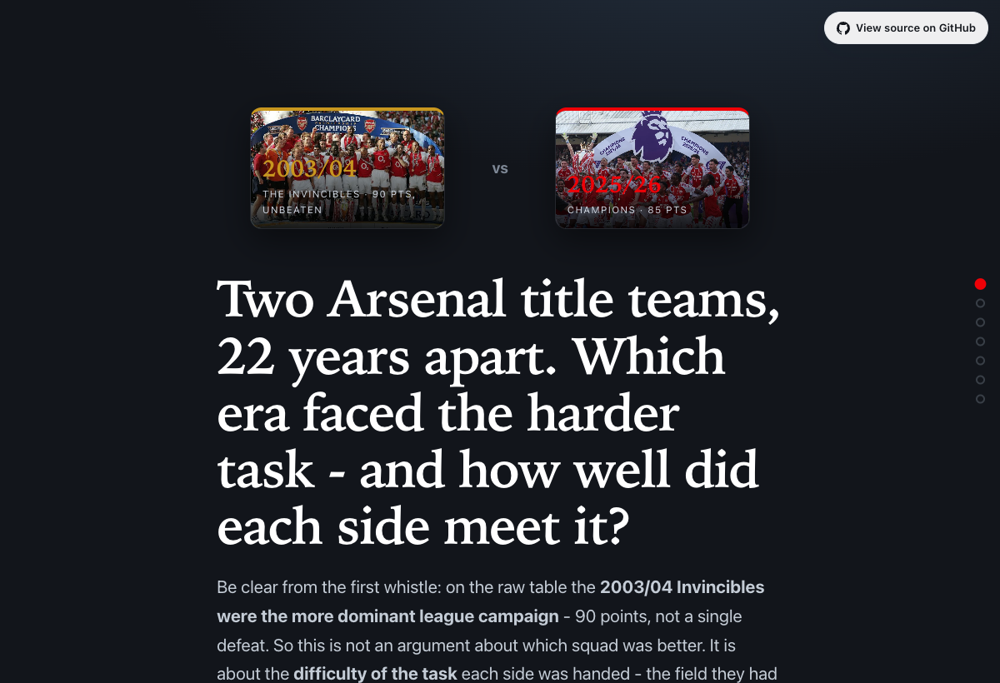

# Two Arsenals - Which Era Was Harder?

A full-stack, narrative **scrollytelling** data app comparing Arsenal's 2003/04
"Invincibles" (38 unbeaten, 90 pts) with the 2025/26 title winners (85 pts, 26-7-5),
asking: **which team actually had the harder job?**

It reads start-to-finish as a guided story - Hook → Meet the teams → four Acts →
a balanced verdict - built on real shot data, an expected-points model, and an
explicit separation of **fact**, **measured model output**, and **speculation**.



> **Live demo:** _deploy with the one-click Render blueprint below and drop the URL here._

---

## The question

On the table the two title runs look close - five points apart. But the eras barely
played the same sport: VAR, a bigger Champions League, a deeper division. This app
tries to compare them **honestly**, and its guiding rule is that the three kinds of
claim are never blended:

| Category | Meaning | Example in the app |
|---|---|---|
| 🟢 **Fact** | Looked-up historical record | Points, results, competitive match counts, final tables |
| 🔵 **Measured** | Output of the xG model on real data | Expected points; points-per-game vs opponent tiers |
| 🟠 **Speculative** | Explicit, assumption-driven estimate | VAR impact; the "transpose the Invincibles" thought experiment |

Every figure on the page carries its category as a badge, and the speculative Act is
visually walled off (dashed borders, its own tint). That separation *is* the exercise.

---

## The model - expected points, and why Poisson-from-xG is reasonable

The measured core (Act 2) answers *"how many points did each team actually deserve?"*

1. **Goals are a Poisson process.** Goals per team per match are low-count, roughly
   independent events - the textbook Poisson use-case. Expected goals (xG) already
   estimates the *mean* goals a team should score, which maps directly onto the Poisson
   rate λ.
2. **Calibrate, don't assume.** Rather than treat `goals = xG`, I fit a Poisson GLM
   (`scikit-learn PoissonRegressor`) of **actual goals on xG**, separately per season
   (StatsBomb and Understat use different xG models, so their xG→goals scaling differs).
   Fitting on both perspectives of every match - goals-for vs xG-for and goals-against
   vs xG-against - gives 2×38 = 76 observations per season.
3. **Rates → points.** From the two calibrated rates I treat the scorelines as
   independent Poisson variables, compute P(win)/P(draw)/P(loss), and sum
   `3·P(win) + 1·P(draw)` over 38 games into **expected points**.

**Result:** both champions beat their expected points - the hallmark of a title team
that wins the tight games - the Invincibles by more (+20.6), and by *out-finishing*
their chances; the 2025/26 side (+15.8) by *out-defending* and holding its nerve.

**Sanity check:** total predicted goals equals total actual goals for each season, so
the GLM is calibrated, not hand-tuned (see `analysis.ipynb`).

**Stated assumptions:** goals are Poisson; the two teams' goal counts in a match are
independent (a known simplification - see *What I'd add*); xG is a sufficient single
predictor of scoring rate.

---

## Data sources

Factual attribution, and the seasons each source covers:

- **2003/04 - [StatsBomb Open Data](https://github.com/statsbomb/open-data)**
  (Premier League, `competition_id=2`, `season_id=44`). Shot-level events; per-shot
  `statsbomb_xg`; minutes derived from lineup position stints. The free set contains
  all 38 of Arsenal's league matches.
- **2025/26 - [Understat](https://understat.com)** (`/team/Arsenal/2025`). Per-match
  xG-for/against from the page's `datesData`, per-player aggregates from `playersData`.
  Understat is behind a Cloudflare JS challenge, so the data is pulled once with a real
  browser (`scripts/fetch_understat.mjs`, puppeteer-core driving local Chrome) and
  **cached to `data/raw/`**.
- **Act-3 historical facts** (competitive match counts per competition; full final
  league tables) are looked-up and cited in `analysis/facts.py` (primarily Wikipedia
  season/competition pages).

**Derived fields, noted for honesty:**
- 2003/04 **minutes** are derived from lineup stints on a 90-minute regulation baseline.
- 2025/26 **shots**: Understat's `playersData` exposes raw shot totals directly, so -
  contrary to what the team-page HTML table (which only shows `Sh90`) suggests - **no
  Sh90×minutes derivation was needed**; I use the real totals.
- The two seasons use **different xG models**, so cross-era xG is compared with that
  caveat (the model is calibrated per-season for exactly this reason).

**Everything runs offline.** The one network step is the Understat fetch; its output and
all processed JSON are committed, so the app and notebook need no live request at load
time. (StatsBomb's 106 MB event cache is git-ignored and re-downloaded on demand by the
loaders.)

---

## Architecture

```
analysis/            data + model layer (importable, tested)
  loaders.py         raw StatsBomb / Understat  ->  canonical pandas frames
  transforms.py      groupby / merge / rolling aggregations
  model.py           PoissonRegressor xG->goals  ->  expected points
  era.py             Act-3 levers + Act-4 thought-experiment range
  facts.py           cited historical facts (Act 3)
  build.py           orchestrates -> data/processed/*.json
analysis.ipynb       narrated Colab notebook (pandas/numpy/sklearn/matplotlib)
scripts/
  fetch_understat.mjs  one-off Understat pull via puppeteer-core + local Chrome
tests/               pytest unit tests for model + transforms
backend/             FastAPI + pydantic; loads processed JSON into SQLite, queried by SQL
  main.py  db.py  models.py
web/                 React + TypeScript + Vite scrollytelling SPA (recharts)
  src/sections/      Hero, MeetTeams, Act1..Act4, Conclusion
  src/components/    charts, shared UI (category badges, reveal-on-scroll)
data/
  raw/               cached source data (Understat committed; StatsBomb git-ignored)
  processed/         the JSON the API + app consume  (committed)
```

Design choice: **no database of record.** Data is processed once into ~0.5 MB of JSON;
the API loads it into an in-memory **SQLite** instance and serves it via real SQL
queries. SQLite earns its place as the query layer without the overhead of a stateful DB.

### REST API

| Endpoint | Description |
|---|---|
| `GET /api/health` | liveness + row counts |
| `GET /api/meta` | dataset provenance |
| `GET /api/seasons` | headline summaries (SQL) |
| `GET /api/matches?season=` | per-match rows incl. rolling form (SQL) |
| `GET /api/players?season=&min_shots=&sort_by=` | player aggregates (SQL) |
| `GET /api/model?season=` | expected-points output + calibration |
| `GET /api/era` | Act-3 levers |
| `GET /api/thought-experiment?var_points=` | **live** Act-4 range recompute (reuses `analysis.era`) |

---

## Tech stack / skills demonstrated

- **Data & modelling:** pandas (groupby/merge/rolling), numpy, scikit-learn
  (`PoissonRegressor`), scipy, matplotlib - narrated in a Colab-ready notebook.
- **Backend:** Python 3.12, FastAPI, pydantic (typed models), SQLite (genuine SQL).
- **Frontend:** React 18 + **TypeScript** (typed components/props), Vite, recharts,
  IntersectionObserver-driven scroll transitions, responsive layout.
- **Fundamentals:** modular `data / model / api / web` split, pytest unit tests,
  Python type hints throughout, pinned `requirements.txt` / `package.json`.

---

## How this maps to the Research Engineer role

I built this as a self-contained demonstration of the exact skill set the role calls
for - end-to-end, from data acquisition to a deployed full-stack product - and to show
*how I think*, not just what I can wire together.

| What the role asks for | Where I demonstrate it |
|---|---|
| **Python + the PyData stack** | `analysis/` package and `analysis.ipynb`: pandas (groupby/merge/rolling), numpy, scikit-learn, scipy, matplotlib |
| **SQL** | `backend/db.py`: processed data loaded into SQLite and served through hand-written SQL queries |
| **JavaScript / TypeScript** | `web/`: React 18 in strict TypeScript - typed components, props, and a typed data layer mirroring the API schema |
| **Full-stack, end-to-end internal products** | one repo takes raw shot data → pandas/sklearn pipeline → FastAPI + SQLite API → React SPA, with a one-command build and a single-URL deploy |
| **Applied machine learning** | `analysis/model.py`: a Poisson GLM (`PoissonRegressor`) mapping xG→goals, propagated to expected points - fit, calibrated, validated, and unit-tested rather than treated as a black box |
| **Data design & visualization** | a deliberate visual language: consistent team colours, per-match xG scatters, a fact/measured/speculative badge system, and matplotlib EDA in the notebook |
| **Communicating to technical *and* non-technical audiences** | the story explains the model in plain English inline; the notebook narrates the reasoning; this README defends the methodology |
| **Grounding work in real-world constraints** | the whole intellectual-honesty spine - never presenting a speculative number as a measured one - is exactly the discipline an analyst needs to trust a tool |
| **Engineering mindset / scalable** | modular `data / model / api / web` split, type hints, pytest, pinned dependencies |
| **Football knowledge & passion** | the question, the framing, and the reading of the results |

**On deep learning (a *desirable*, not a requirement).** This dataset is 38 matches per
season, so I deliberately used a calibrated Poisson GLM rather than a neural network -
the right tool for the data. I'd reach for deep learning where the role actually points
(sequence models over event streams, Geometric Deep Learning on player-graph / tracking
data); see *What I'd add* for where that fits. Knowing *when not to* deep-learn is part of
the job.

---

## Run it locally

**Prerequisites:** Python 3.12, Node 18+.

```bash
# 1. Analysis layer + (re)build the processed data. The StatsBomb cache downloads
#    on first run; the Understat cache is already committed.
python3.12 -m venv .venv && source .venv/bin/activate
pip install -r requirements.txt
python -m analysis.build            # writes data/processed/*.json (+ web/public/data)
pytest -q                           # 14 unit tests

# 2. API  ->  http://localhost:8000
pip install -r backend/requirements.txt
uvicorn main:app --app-dir backend --reload --port 8000

# 3. Web  ->  http://localhost:5173   (second terminal; /api is proxied to :8000)
cd web && npm install && npm run dev
```

To refresh the 2025/26 data from Understat: `cd scripts && npm install && npm run fetch`.

---

## Deploy to a public URL

**GitHub Pages (no third-party host).** The SPA is fully static (it reads the committed
JSON in `web/public/data` and recomputes the Act-4 slider client-side), so it runs on
Pages with nothing else. The committed workflow [`.github/workflows/deploy.yml`](.github/workflows/deploy.yml)
builds `web/` and publishes it on every push to `main`. Just enable it once:
**repo Settings → Pages → Build and deployment → Source: GitHub Actions.** The site lands
at `https://<username>.github.io/<repo>/`. (Pages is static-only, so the FastAPI backend
isn't executed there; it stays in the repo as source. `vite.config.ts` uses a relative
`base` so assets resolve under the project subpath.)

**One service, one URL incl. the live API (Render).** The committed [`render.yaml`](render.yaml)
builds the SPA and serves it from the FastAPI process (SPA at `/`, API at `/api`). Push
to GitHub → Render → **New → Blueprint** → select the repo.

**Split (Vercel + Render).** Deploy `web/` to Vercel (framework: Vite); deploy `backend/`
to Render. Since the SPA reads its own baked JSON, the API is only needed for the live
thought-experiment endpoint.

---

## What I'd add with more time

- **Deep learning where the data justifies it.** With event/tracking data (not just
  38 match-level xG totals), this is where I'd apply the techniques the role centres on:
  a **Transformer** over possession/event sequences to model chance quality in context,
  or **Geometric Deep Learning** on the player-position graph for pitch control - using
  **PyTorch**. On this small, aggregate dataset a calibrated GLM is the honest choice;
  DL earns its place once the data does.
- **Bivariate Poisson / Dixon-Coles** to drop the goal-independence assumption and
  correct low-score correlation.
- **Cross-validation** and a hold-out for the GLM, plus **uncertainty bands** on expected
  points (simulate each match from its λ) so the measured section carries error bars too.
- **Player physical data** (distance, sprints) and **defensive metrics** (pressures,
  PPDA) - absent from open xG feeds - to compare *styles*, not just outputs.
- **More seasons / teams:** the pipeline is parameterised on `(competition, season, team)`.
- Split the recharts bundle (currently ~565 KB) via lazy-loaded chart chunks.

---

## Attribution

- 2003/04 data © [StatsBomb](https://statsbomb.com/), used under their
  [Open Data terms](https://github.com/statsbomb/open-data/blob/master/LICENSE.pdf).
- 2025/26 data from [Understat](https://understat.com), used for a non-commercial
  educational portfolio piece.
- Historical facts: Wikipedia (cited per-figure in `analysis/facts.py`).
